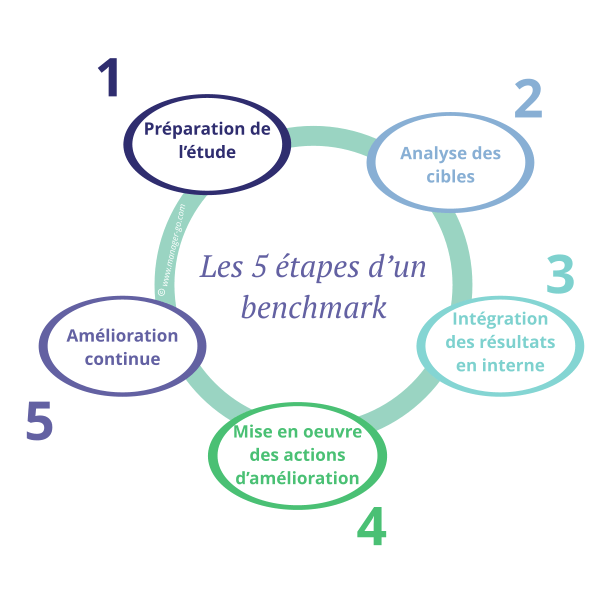
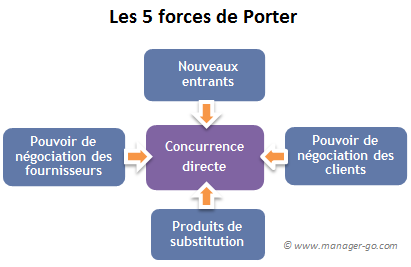
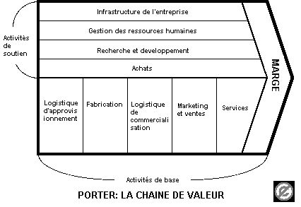

# BenchMarking

## Definition

### **Benchmarking**

Le benchmarking peut être défini comme une démarche de comparaison utilisée essentiellement pour évaluer la performance des processus d'une entreprise, vis-à-vis d'un pair ou d'un concurrent jugé comme référent, dans une logique de quête des "bonnes pratiques" après définition d'une métrique.

Cette étude, particulièrement complète lorsqu'elle s'effectue dans les règles de l'art, permet ainsi de qualifier les processus, d'en préciser les avantages et les faiblesses et d'identifier les voies d'amélioration continue. 

## Application du benchmarking

Le benchmarking est une démarche aux multiples usages, aux diverses applications. Les résultats d'une opération de benchmarking seront aussi un précieux enseignement lors d'une analyse stratégique en complément d'une étude SWOT.

Il ne faut pas pour autant que la quête des bonnes pratiques tue dans l'oeuf toutes réflexions d'innovation organisationnelles. S'inspirer des modèles pour trouver sa propre voie sera bien plus profitable en un univers concurrentiel que de chercher à les copier à la lettre près. Le rôle de suiveur est difficilement tenable dans la durée.

Le benchmarking peut bien entendu être utilisé pour évaluer non seulement les processus de conception, de fabrication, de commercialisation/diffusion, mais aussi les produits réalisés, les services fournis ou encore les activités de support et soutien. 

## 7 Etapes du processus de benchmarking

1. Que doit-on comparer ?
Il s'agit de se focaliser sur les axes de progrès, les aspects que l'on a sélectionnés comme pistes d'amélioration.
2. Quelle est la cible ?
On recherche les leaders qui excellent pour les aspects sélectionnés à l'étape précédente.
3. Quelles mesures ?
On précise les critères et les mesures.
4. La collecte d'information
Aucune source d'informations n'est à négliger. Le point de vue des clients n'est pas la moindre des informations à collecter...
5. Analyse
Deux questions : pù sommes-nous meilleurs et pourquoi ? Où sont-ils meilleurs et pourquoi ?
6. Une démarche active
Le benchmarking n'est que la première pierre du changement, ensuite il faut passer à l'action...
7. Un nouveau benchmark
On relance un nouveau benchmark dans une démarche de progrès continu.

## Mise en place d'un benchmark en 5 étapes

1. Préparation de l'étude benchmark

**Définissez le périmètre de l’étude**

Déterminez en premier lieu quel va être le sujet de l’étude. Autrement dit : quelle partie de l’organisation est mise sous action (un service, un processus, un produit ?). Au demeurant, la décision de recourir à cet outil se fait souvent après avoir constaté un dysfonctionnement ou bien des résultats perfectibles pour un domaine critique.

**Choisissez l'entreprise étalon**

Il est ensuite nécessaire d'identifier à qui se comparer. Décidez si la référence est à chercher en interne ou bien en externe. Sélectionnez la (ou les) organisation(s) en adéquation avec l'action de progrès que vous souhaitez mener. Identifiez et dresser la liste des concurrents clés en cohérence avec le périmètre de l'étude si votre objectif est de vous appuyer sur leurs pratiques pour développer des avantages concurrentiels.

**Sélectionnez les méthodes de collecte des informations**

Une fois les références identifiées, élaborez un plan de collecte des données. Selon le type de référence choisie, l’accès aux informations peut se révéler plus ou moins complexe. Important : les informations recueillies doivent être de type quantitatif . Un processus de benchmarking s’élabore à partir de données chiffrées. Les moteurs de recherche permettent de trouver de précieuses informations à condition de bien choisir ses mots clés. Si l'activité en question est dans le domaine du digital (e-commerce...), il est souvent plus facile de collecter de précieuses données.

2. Analyse des cibles

**Déterminez les écarts de performance et leurs causes**

Analysez en détail les résultats des partenaires (ou concurrents) de référence et les comparer avec vos propres performances. Recherchez les raisons des écarts.

**Fixez les seuils de performance à atteindre**

À la lumière de l’analyse menée précédemment, fixez des objectifs globaux pour votre propre organisation.

3. Intégration des résultats en interne

**Communiquez les résultats de la phase d’étude du benchmarking**

Comme tout projet, il est indispensable d' obtenir l’adhésion du personnel impacté plus ou moins directement en communiquant sur le sujet et en démontrant la crédibilité des conclusions. Chaque collaborateur doit intégrer les impacts sur sa propre activité.

**Définissez des objectifs fonctionnels**

Déclinez les objectifs globaux en objectifs opérationnels concrets pour les collaborateurs concernés.

4. Mise en oeuvre des actions d'amélioration

**Elaborez le plan d’action**

Mettez en musique les actions nécessaires pour atteindre les objectifs opérationnels fixés. Utilisez la méthode Qui-Quoi-Où-Quand-Comment-Pourquoi pour ne rien oublier. Définissez des indicateurs pour s’assurer de la bonne avancée des opérations.

**Mettez en œuvre le plan d’action**

Lancez les opérations et les piloter à travers un tableau de bord et autres outils de pilotage.

5. Amélioration continue

**Réévaluez les références**

S’agissant d’un processus continu, assurez-vous que les référentiels, comme les seuils de performance à atteindre, restent pertinents.

## Différents types de benchmarking

### **Benchmarking Interne**

Cette approche concerne les grandes structures. La comparaison se conduit au sein de sa propre organisation (entre filiales, sites, services…). C’est la plus facile à mettre en œuvre, car les données sont disponibles et les intervenants facilement accessibles.

### **Benchmarking Concurrentiel**

Cette approche consiste à se comparer avec la concurrence (concurrents directs et indirects). Elle concerne généralement les activités visibles par les clients : produit et services. La collecte d’informations se révèle être généralement ardue. Elle repose sur une analyse concurrentielle approfondie.

Le repérage des compétiteurs peut se réaliser à travers une veille concurrentielle, une étude de marché ou bien lors de l'élaboration d'une stratégie marketing ou stratégie d'entreprise (par exemple lors d'un SWOT  : outil d'analyse des Forces et Faiblesses - Opportunités et Menaces). L'objectif est de les surpasser.

### **Benchmarking Fonctionnel

L’attention est portée sur une fonction particulière (par exemple : assurer le SAV).

### **Benchmarking Générique

La recherche de l’étalon se fait par rapport à une entreprise particulièrement performante dans la fonction visée,  quel que soit son secteur d’activité. Par exemple, une entreprise industrielle générant de nombreuses livraisons de faible valeur peut se comparer à un VPCiste traditionnel B2C. L’échange d’informations est généralement facilité grâce à une absence de concurrence.

## Facteurs clés de succès

Pour réussir votre projet, voici des points importants à prendre en considération :

* **Implication de la direction** : un élément essentiel pour la crédibilité du projet et pour les moyens mis à disposition.
* **Choix du sujet sous étude** : Il est important de savoir choisir un domaine pertinent : critique en termes de performance et ayant un impact sur la satisfaction client. Attention à bien définir le périmètre étudié.
* **Maîtrise du fonctionnement du service ou processus étudié** : pour améliorer, il faut d’abord connaître ! Si ce n’est pas le cas, la première étape consiste à mener un diagnostic complet du domaine sous étude.
* **Pertinence des indicateurs retenus** : la mesure de la performance est une phase clé pour s’assurer de la bonne avancée des actions.
* **Accessibilité et qualité des données** : sans données chiffrées et fiables, pas de benchmarking possible...
* **Communiquer et communiquer encore** : l’adhésion et l’implication du personnel sont un facteur essentiel pour la réussite du projet. Un impératif est de communiquer régulièrement sur l’avancement des opérations.

## Outils du benchmarking

### **5 Forces de porter**

### **Chaine de valeur**

