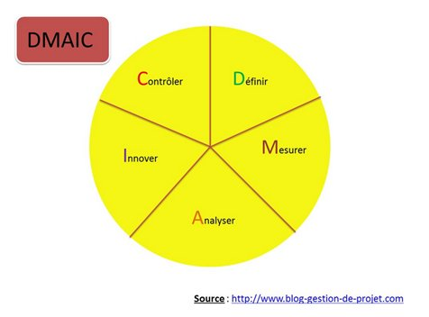

# Qualité & controle interne

## Definition

### **Qualité**

Toutes les entreprises travaillent autour de la qualité. Que ce soit pour la vente de produit ou de service, la qualité est omniprésente.

En entreprise la notion de qualité vient du taylorisme, mouvement qui prône la « meilleure façon de produire ». Les entreprises veulent produire un produit ou un service de qualité et qui réponde à la demande et aux besoins des consommateurs.

Dans une entreprise, la gestion de la qualité concerne aussi bien l'organisation que la production.

Au sein d'une entreprise, la gestion de la qualité a plusieurs composantes:

* démarche qualité,
* système qualité,
* audit qualité,
* contrôle qualité,
* assurance qualité,
* charte qualité.

L'organisation international de normalisation ISO, décline en 7 principes de management la qualité aussi bien pour l'ISO 9001 mais aussi pour les normes connexes. Anciennement décliné en 8 principes, la version 2015, a modifié cette notion en 7 principes avec le passage à la version 2015 de l'ISO 9001.

Ces 7 principes permettent à un organisme de structurer son organisation, ses processus, les activités en les prenant en compte. Ils sont un guide qui vient compléter les exigences normatives en les explicitant.

Les 7 principes sont les suivants :

* Orientation client
* Leadership
* Implication du personnel
* Approche processus
* Amélioration
* Prise de décision fondée sur des preuves
* Management des relations avec les parties intéressées

Il est important de préciser que précédemment l'ISO définissait la qualité (ou les systèmes de management par la qualité) en 8 principes. "L'approche système" a été supprimée en tant que principe. Il persiste tout de même dans la notion d'approche processus.

L'approche processus se définit par entre autres 3 exigences :

1. "Déterminer les processus nécessaires au SMQ et leur application dans tout l'organisme"
2. "Déterminer pour chaque processus ses éléments entrants et ses produits ou services en sortie"
3. "Déterminer la séquence et les interactions de ces processus"

Ce qui revient à mettre en place une approche système. 

### **Lean Management**

Le Lean management, introduit au sein des usines Toyota (Toyota Production System) au cours des années 70, est un système d'organisation assez complexe. L'objectif étant d'améliorer au mieux la performance des processus en exploitant les méthodes, techniques et pratiques déjà à disposition. Le Juste à temps, la qualité à tous les niveaux des processus et la réduction des coûts sont au programme. 

Vue sous un angle plus pratique, la démarche repose sur la résolution active des problèmes de production et donc:

* la diminution des stocks, 
* la lutte contre les gaspillages et la réduction des défauts, 
* le juste à temps, 
* la production à flux tirés (Kanban...) et la maîtrise des délais, 
* la flexibilité et la gestion efficace des compétences, 
* tout comme la réduction des coûts, sont parties intégrantes de la démarche.

### **PDCA (Plan Do Check Act)**

La désormais célèbre "roue de Deming" a eté popularisée par William Edwards Deming, promoteur de la qualité made in Japan. Cette méthode présente les 4 phases à enchainer successivement afin de s'inscrire assurément dans une logique d'amélioration continue.

* Plan
  * Planifier et préparer le travail à effectuer. Etablir les objectifs définir les tâches à exécuter. Spécifier les missions et les responsabilités. On n'oubliera surtout pas de préciser les critères de performance.
* Do
  * Faire, réaliser, exécuter les tâches prévues. Il peut être intéressant de limiter l'ampleur et la portée des tâches à exécuter afin de disposer d'un meilleur contrôle (processus répétitif). Un projet court est plus facile à piloter et, sans craindre la lapalissade, il délivre les résultats plus rapidement. On peut alors mieux réorienter la suite du projet quel qu'il soit.
* Check
  * Vérifier les résultats. Mesurer et comparer avec les prévisions. C'est le point clé de l'amélioration continu. La phase de vérification, ce n'est pas uniquement l'instant où l'on distribue les médailles et les coups de pied. C'est celui où l'on prend conscience de la difficulté (ou de la simplicité) d'un tâche donnée. C'est aussi celui où l'on apprend à mieux maîtriser ses prévisions.
* Act
  * Agir, corriger, prendre les décisions qui s'imposent. Identifier les causes des dérives entre le réalisé et l'attendu. Identifier les nouveaux points d'intervention, redéfinir les processus si nécessaire.

Boucler, c'est une roue, on revient à la première étape tant que l'objectif ultime n'est pas atteint.

### **6 Sigma**

La méthode Six Sigma, orientée qualité, vise à réduire la variabilité d’un processus pour tendre vers le zéro défaut. La méthode Six Sigma se base sur une démarche fondée à la fois sur la voix du client (enquêtes, etc.) et sur des données mesurables (indicateurs , etc) et fiables.

Pourquoi mettre en place la méthode des 6 sigma : 

En mettant en place la méthode 6 Sigma, on améliore la qualité des produits et donc la performance de l’entreprise.

Ceci est possible grâce à la réduction de la non-qualité, des déchets, des retouches et ajustements.

En adoptant l’approche 6 Sigma, nous pouvons alors :

* Réduire des défauts des processus de fabrication et de services;
* Améliorer le rendement et la la performance;
* Atteindre les standards Six Sigma, ce qui pourrait signifier avoir plus de part de marché;
* Développer une culture de management par les résultats (Result based Management) à travers les mesures;
* Augmenter les gains grâce à la maîtrise des processus et la réduction des pertes et coûts liés aux retouches et ajustements;
* Améliorer la satisfaction du client;

Pour mettre en place la méthode des 6 sigma:

* Mesurer les attentes des clients;
* Mesurer la performance des processus métier de l’entreprise par rapport à ces attentes;
* Utiliser des outils statistiques pour analyser les causes qui influent sur la performance;
* Mettre en place des solutions pour corriger les causes sources de non-performance;
* Utiliser des outils de mesure pour contrôler que les solutions mises en place ont bien l’effet attendu sur l’amélioration de la performance.

## Type de qualité

### **Qualité externe**

La qualité dite externe est la réponse aux attentes des clients. Elle se mesure donc par la satisfaction des clients ayant consommé le produit ou le service vendu par l'entreprise.

Assurer la qualité externe est vital pour une entreprise. Cela permet de:

* fidéliser la clientèle,
* être compétitif face à la concurrence,
* de dominer le marché sur lequel elle agit.

Pour améliorer la qualité externe, plusieurs méthodes sont à la disposition de l'entreprise, à savoir:

* les sondages,
* le contrôle qualité,
* l'audit qualité.

### **Qualité interne**

La qualité interne concerne l'organisation de l'entreprise. Elle regroupe les méthodes pour améliorer la production, les conditions de travail et le management d'une entreprise.

Parmi ces techniques de qualité, on retrouve:

* 5S,
* Kaizen,
* roue de Deming,
* AMDEC,
* qualité totale,
* Six Sigma.
